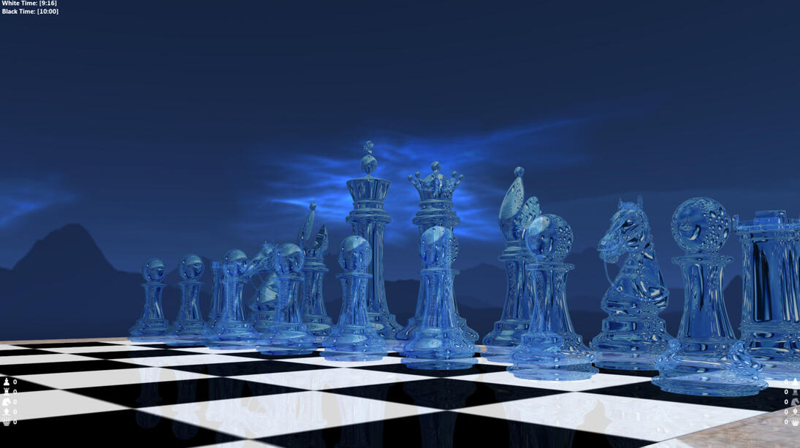

# Ethereal Chess

High detail 3D chess program capable of communicating with any UCI compatible AI engine. It communicates with these engines through pipes to send/receive chess game events. It also provides chessboard and environment customization options.

